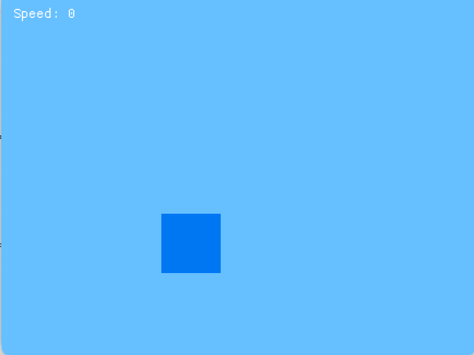

I have implemented the racer game in Rust using the macroquad library, employing a pseudo-3D projection technique similar to Lotus Esprit Turbo Challenge. 
The game features:
- Pseudo-3D Engine: A segment-based road system with curvature and perspective projection.
- Gameplay: Singleplayer mode where you race against 5 AI opponents.
- Controls: Use Up to accelerate, Down to brake, and Left/Right to steer.
- Visuals: Retro-style rendering with a scrolling road, color-coded grass, and blocky car sprites representing the Amiga era's aesthetic.
To run the game:
1. Ensure you have Rust installed.
2. Run cargo run in the project directory.
cargo run

##

