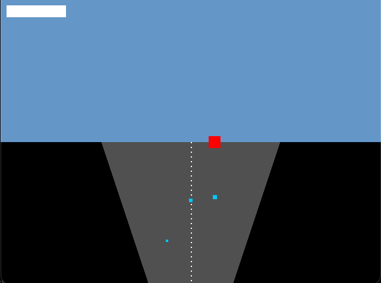

# Lotus Esprit Turbo Challenge Style Racer

Native Rust racer game with Amiga-style pseudo-3D graphics.

## Controls
- Up Arrow / W: Accelerate
- Down Arrow / S: Brake
- Left Arrow / A: Steer left
- Right Arrow / D: Steer right
- Escape: Quit

## Features
- Singleplayer mode vs 5 AI opponents
- Pseudo-3D road rendering
- Keyboard controls only
- 640x480 resolution with pixel scaling
- Procedural audio placeholders

## Build
```bash
cargo build --release
```

Run with SDL2 library path set:
```bash
export LIBRARY_PATH=/opt/homebrew/lib:$LIBRARY_PATH
./target/release/lotus_racer
```

##

