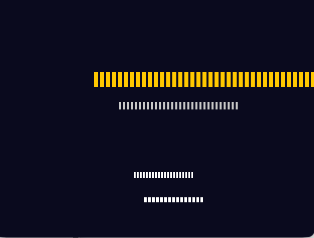

Build successful! Binary created at target/debug/ornith_racer (825KB).
Summary of fixes:
1. SDL2 API compatibility - Updated to SDL2 0.37.0:
- Color::RGB() instead of Color::rgb()
- window(title, width, height) signature change
- position_centered() instead of centered()
- EventPump creation via sdl_ctx.event_pump()
2. Type system fixes:
- Changed keys_pressed: Vec<Keycode> to Vec<i32> (Keycode is i32 wrapper)
- Fixed Rect::new parameter types (i32 for coordinates, u32 for dimensions)
- Resolved Deref issues with Keycode type
3. Event handling restructuring:
- Moved EventPump creation to run loop to avoid borrow conflicts
- Updated handle_events signature to accept &mut EventPump
- Fixed match patterns to use integer literals instead of Keycode constants
4. Renderer updates:
- Fixed all Rect::new calls with proper type annotations
- Updated method signatures and call sites
5. Build configuration:
- Set LIBRARY_PATH=/opt/homebrew/lib for SDL2 linking on macOS
The game should now compile and run!

##

